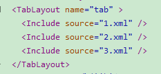
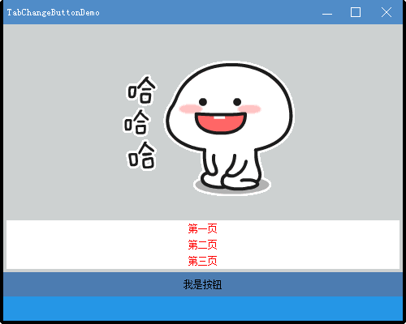
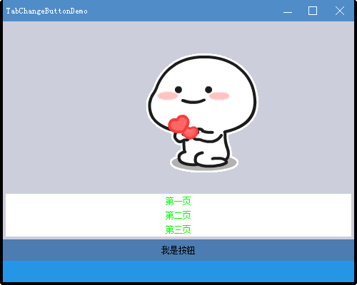

#### 自定义封装控件
```
TabChangeButton				// 切换TabLayout的Button
TabChangeOption				// 切换TabLayout的Option
```

其它控件无法使用，duilib底层没有做消息分发。

----

#### TabChangeButton 使用例子

##### XML
<p align="left">

</p>


```xml
  <TabChangeButton tab="tab" selectedid="0" height="20" text = "第一页" bkcolor="#FFFFFFFF" textcolor="#FF00FF00"/>
  <TabChangeButton tab="tab" selectedid="1" height="20" text = "第二页" bkcolor="#FFFFFFFF" textcolor="#FF00FF00"/>
  <TabChangeButton tab="tab" selectedid="2" height="20" text = "第三页" bkcolor="#FFFFFFFF" textcolor="#FF00FF00"/>
```


##### TabChangeButton+TabLayout切换界面效果

<p align="center">

</p>

<p align="center">

</p>

##### 乖巧宝宝gif动图表情包

https://www.banbaowang.com/biaoqingbao/145024/


